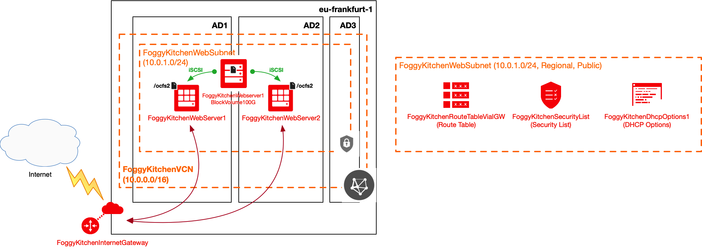

# Terraform OCI Shared Block Volume and OCFS2

## Project description

In this repository, I have documented my hands on experience with Terrafrom for the purpose of OCI Shared Block Volume and OCFS2 deployment. This set of HCL based Terraform files whioch can customized according to any requirements.   

## Topology diagram

Here is topology diagram of the OCI infrastructure which will be build with Terraform code available in this repository:



## How to use code 

### STEP 1.

Clone the repo from github by executing the command as follows and then go to terraform-oci-shared-volume directory:

```
[opc@terraform-server opc]$ git clone https://github.com/mlinxfeld/terraform-oci-shared-volume.git
Cloning into 'terraform-oci-shared-volume'...
remote: Enumerating objects: 19, done.
remote: Counting objects: 100% (19/19), done.
remote: Compressing objects: 100% (16/16), done.
remote: Total 19 (delta 2), reused 19 (delta 2), pack-reused 0
Unpacking objects: 100% (19/19), done.

[opc@terraform-server opc]$ cd terraform-oci-shared-volume/

[opc@terraform-server terraform-oci-shared-volume]$ ls -latr
razem 76
drwxrwxr-x. 4 opc opc   78 01-15 14:52 ..
-rw-rw-r--. 1 opc opc  307 01-15 14:52 README.md
-rw-rw-r--. 1 opc opc  250 01-15 14:52 internet_gateway.tf
-rw-rw-r--. 1 opc opc  442 01-15 14:52 dhcp_options.tf
-rw-rw-r--. 1 opc opc  144 01-15 14:52 compartment.tf
drwxrwxr-x. 2 opc opc   23 01-15 14:52 userdata
-rw-rw-r--. 1 opc opc  556 01-15 14:52 subnets.tf
-rw-rw-r--. 1 opc opc  957 01-15 14:52 shared_volume_block.tf
-rw-rw-r--. 1 opc opc 1445 01-15 14:52 security_lists.tf
-rw-rw-r--. 1 opc opc  431 01-15 14:52 routes.tf
-rw-rw-r--. 1 opc opc  239 01-15 14:52 provider.tf
-rw-rw-r--. 1 opc opc 8534 01-15 14:52 null_resources.tf
-rw-rw-r--. 1 opc opc 2412 01-15 14:52 iscsiattach.sh
-rw-rw-r--. 1 opc opc 1145 01-15 14:52 webserver_instance2.tf
-rw-rw-r--. 1 opc opc 1145 01-15 14:52 webserver_instance1.tf
-rw-rw-r--. 1 opc opc  225 01-15 14:52 vcn.tf
-rw-rw-r--. 1 opc opc  916 01-15 14:52 variables.tf
drwxrwxr-x. 8 opc opc 4096 01-15 14:52 .git
drwxrwxr-x. 4 opc opc 4096 01-15 14:52 .

```

### STEP 2.

Within web browser go to URL: https://www.terraform.io/downloads.html. Find your platform and download the latest version of your terraform runtime. Add directory of terraform binary into PATH and check terraform version:

```
[opc@terraform-server terraform-oci-shared-volume]$ export PATH=$PATH:/home/opc/terraform

[opc@terraform-server terraform-oci-shared-volume]$ terraform --version

Terraform v0.12.16

Your version of Terraform is out of date! The latest version
is 0.12.17. You can update by downloading from https://www.terraform.io/downloads.html
```

### STEP 3. 
Next create environment file with TF_VARs:

```
[opc@terraform-server terraform-oci-shared-volume]$ vi setup_oci_tf_vars.sh
export TF_VAR_user_ocid="ocid1.user.oc1..aaaaaaaaob4qbf2(...)uunizjie4his4vgh3jx5jxa"
export TF_VAR_tenancy_ocid="ocid1.tenancy.oc1..aaaaaaaas(...)krj2s3gdbz7d2heqzzxn7pe64ksbia"
export TF_VAR_compartment_ocid="ocid1.tenancy.oc1..aaaaaaaasbktyckn(...)ldkrj2s3gdbz7d2heqzzxn7pe64ksbia"
export TF_VAR_fingerprint="00:f9:d1:41:bb:57(...)82:47:e6:00"
export TF_VAR_private_key_path="/tmp/oci_api_key.pem"
export TF_VAR_region="eu-frankfurt-1"
export TF_VAR_private_key_oci="/tmp/id_rsa"
export TF_VAR_public_key_oci="/tmp/id_rsa.pub"

[opc@terraform-server terraform-oci-autoscale]$ source setup_oci_tf_vars.sh
```

### STEP 4.
Run *terraform init* with upgrade option just to download the lastest neccesary providers:

```
[opc@terraform-server terraform-oci-shared-volume]$ terraform init -upgrade

Initializing the backend...

Initializing provider plugins...
- Checking for available provider plugins...
- Downloading plugin for provider "oci" (hashicorp/oci) 3.57.0...
- Downloading plugin for provider "null" (hashicorp/null) 2.1.2...

The following providers do not have any version constraints in configuration,
so the latest version was installed.

To prevent automatic upgrades to new major versions that may contain breaking
changes, it is recommended to add version = "..." constraints to the
corresponding provider blocks in configuration, with the constraint strings
suggested below.

* provider.null: version = "~> 2.1"

Terraform has been successfully initialized!

You may now begin working with Terraform. Try running "terraform plan" to see
any changes that are required for your infrastructure. All Terraform commands
should now work.

If you ever set or change modules or backend configuration for Terraform,
rerun this command to reinitialize your working directory. If you forget, other
commands will detect it and remind you to do so if necessary.
```

### STEP 5.
Run *terraform apply* to provision the content of this repo (type **yes** to confirm the the apply phase):

```
[opc@terraform-server terraform-shared-volume]$ terraform apply

(...)

Plan: 16 to add, 0 to change, 0 to destroy.

Do you want to perform these actions?
  Terraform will perform the actions described above.
  Only 'yes' will be accepted to approve.

  Enter a value: yes

(...)

Apply complete! Resources: 16 added, 0 changed, 0 destroyed.

```

### STEP 6.
After testing the environment you can remove the OCI infra. You should just run *terraform destroy* (type **yes** for confirmation of the destroy phase):

```
[opc@terraform-server terraform-oci-shared-volume]$ terraform destroy

oci_identity_compartment.FoggyKitchenCompartment: Refreshing state... [id=ocid1.compartment.oc1..aaaaaaaagillnk7ttj6wpdhmewpibpxc5gbmrfxdtmaa3gfgjzbudesm3tsq]
oci_core_volume.FoggyKitchenWebserverBlockVolume100G: Refreshing state... [id=ocid1.volume.oc1.eu-frankfurt-1.abtheljtll62kegur6wcpxhhte565z6w3zwekuy7g2p3woyvbjlzvajsdwua]
oci_core_virtual_network.FoggyKitchenVCN: Refreshing state... [id=ocid1.vcn.oc1.eu-frankfurt-1.amaaaaaadngk4giaikqtln2je6fljv4zv4j3to6srgrwhudftuwpeym4p2yq]
(...)

Plan: 0 to add, 0 to change, 16 to destroy.

Do you really want to destroy all resources?
  Terraform will destroy all your managed infrastructure, as shown above.
  There is no undo. Only 'yes' will be accepted to confirm.

  Enter a value: yes

(...)

Destroy complete! Resources: 16 destroyed.
```
